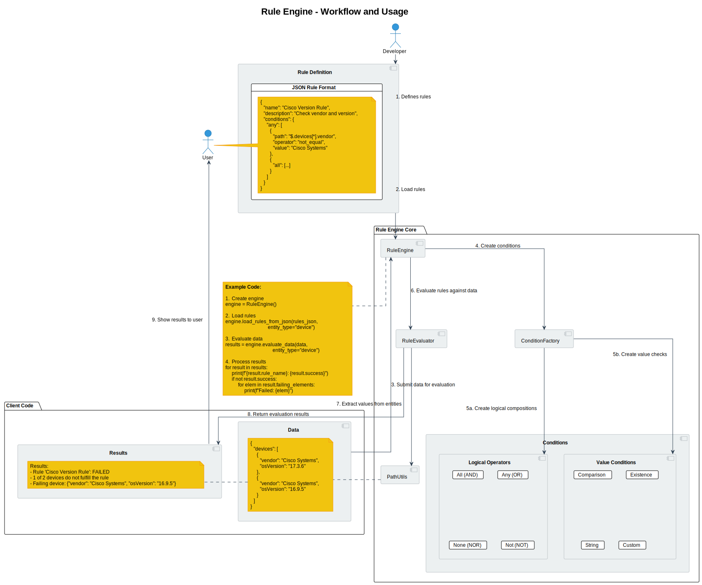
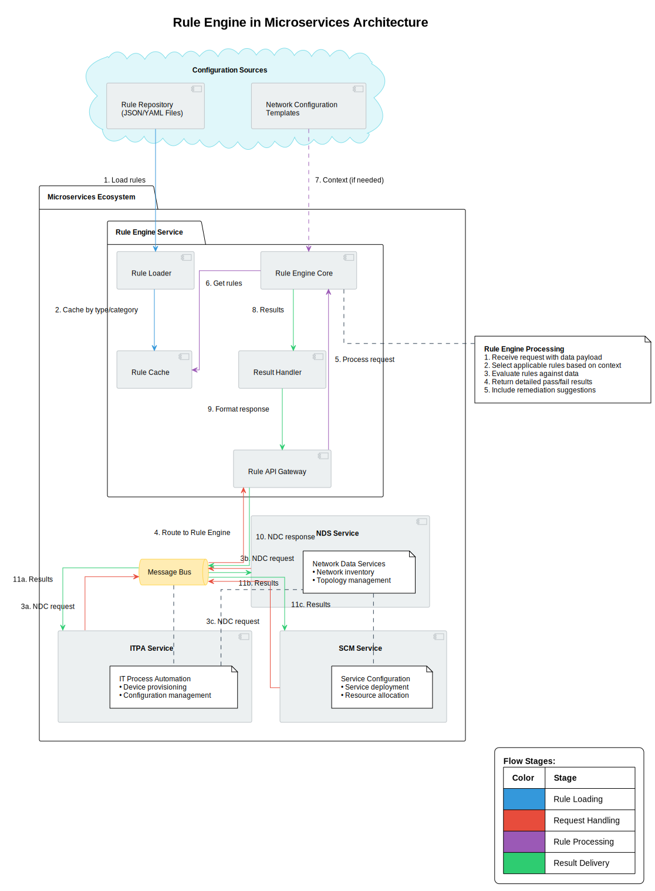

# Rule Engine NDC

A modular and flexible rule engine for evaluating conditions against data.

## Features

- Modular design with clear separation of concerns
- Support for complex nested conditions with logical operators (AND, OR, NOT, NONE)
- Various operators for comparing values (equality, inequality, numeric comparisons, etc.)
- Easily extensible with new operators and condition types
- Simplified path syntax for accessing entity properties
- Detailed evaluation results with failing elements
- JSON-based rule definitions for easy creation and sharing

## Installation

```bash
# Clone the repository
git clone <pending>
cd RuleEnginePOC3

# Install the package
pip install -e .
```

## Usage

### Basic Usage

```python
from rule_engine import RuleEngine

# Create a rule engine
engine = RuleEngine()

# Load rules from a JSON string
engine.load_rules_from_json(rules_json, entity_type="device", category="validation")

# Load rules from a file
engine.load_rules_from_file("rules/device_rules.json", entity_type="device")

# Evaluate data against the rules
results = engine.evaluate_data(data, entity_type="device")

# Process the results
for result in results:
    print(f"{result.rule_name}: {'PASS' if result.success else 'FAIL'} - {result.message}")
    
    # Get failing elements
    if not result.success:
        for element in result.failing_elements:
            print(f"  Failed element: {element}")
```

## Defining Rules

Rules in the rule engine are defined using a structured JSON format. This section explains how to create, modify, and combine rules for different use cases.

### Basic Rule Structure

A rule consists of a name, optional description, and conditions:

```json
{
  "name": "Simple Rule",
  "description": "A simple rule example",
  "conditions": {
    "path": "$.devices[*].status",
    "operator": "equal",
    "value": "active"
  }
}
```


### Workflow and Usage


### Available Operators

The rule engine supports various operators for different data types:

| Operator | Aliases | Description | Example |
|----------|---------|-------------|---------|
| `equal` | `eq` | Tests if values are equal | `{"operator": "equal", "value": "Cisco"}` |
| `not_equal` | `neq` | Tests if values are not equal | `{"operator": "not_equal", "value": "down"}` |
| `greater_than` | `gt` | Tests if value is greater than target | `{"operator": "gt", "value": 90}` |
| `less_than` | `lt` | Tests if value is less than target | `{"operator": "lt", "value": 10}` |
| `greater_than_equal` | `gte` | Tests if value is greater than or equal to target | `{"operator": "gte", "value": 100}` |
| `less_than_equal` | `lte` | Tests if value is less than or equal to target | `{"operator": "lte", "value": 50}` |
| `exists` | - | Tests if a value exists (is not null) | `{"operator": "exists", "value": true}` |
| `not_empty` | - | Tests if a collection or string is not empty | `{"operator": "not_empty", "value": true}` |
| `match` | `matches` | Tests if a string matches a regex pattern | `{"operator": "match", "value": "^[A-Z]{3}-\\d{4}$"}` |
| `contains` | - | Tests if a string/array contains a value | `{"operator": "contains", "value": "error"}` |

### Path Syntax

Paths use a simplified JSONPath-like syntax to access entity properties:

- `$.devices[*].vendor` - Access the vendor property for each device
- `status` - Access a top-level property named "status"
- `network.interfaces[0].ipAddress` - Access a nested property

### Logical Operators for Complex Rules

The rule engine supports logical operators to create complex conditions:

#### AND Logic (`all`)

All conditions must be satisfied:

```json
{
  "name": "AND Example",
  "conditions": {
    "all": [
      {
        "path": "$.devices[*].vendor",
        "operator": "equal",
        "value": "Cisco Systems"
      },
      {
        "path": "$.devices[*].status",
        "operator": "equal",
        "value": "active"
      }
    ]
  }
}
```

#### OR Logic (`any`)

At least one condition must be satisfied:

```json
{
  "name": "OR Example",
  "conditions": {
    "any": [
      {
        "path": "$.devices[*].status",
        "operator": "equal",
        "value": "active"
      },
      {
        "path": "$.devices[*].status",
        "operator": "equal",
        "value": "standby"
      }
    ]
  }
}
```

#### NOT Logic (`not`)

The condition must not be satisfied:

```json
{
  "name": "NOT Example",
  "conditions": {
    "not": {
      "path": "$.devices[*].status",
      "operator": "equal",
      "value": "down"
    }
  }
}
```

#### NONE Logic (`none`)

None of the conditions can be satisfied:

```json
{
  "name": "NONE Example",
  "conditions": {
    "none": [
      {
        "path": "$.devices[*].status",
        "operator": "equal",
        "value": "down"
      },
      {
        "path": "$.devices[*].status",
        "operator": "equal",
        "value": "error"
      }
    ]
  }
}
```

### Nested Logical Operators

Logical operators can be nested to create complex rule structures:

```json
{
  "name": "Complex Nested Rule",
  "description": "Checks for Cisco devices with proper versioning OR non-critical devices",
  "conditions": {
    "any": [
      {
        "all": [
          {
            "path": "$.devices[*].vendor",
            "operator": "equal",
            "value": "Cisco Systems"
          },
          {
            "path": "$.devices[*].osVersion",
            "operator": "equal",
            "value": "17.3.6"
          }
        ]
      },
      {
        "all": [
          {
            "not": {
              "path": "$.devices[*].criticality",
              "operator": "equal",
              "value": "high"
            }
          },
          {
            "path": "$.devices[*].status",
            "operator": "equal",
            "value": "active"
          }
        ]
      }
    ]
  }
}
```

This rule checks for either:
1. Cisco devices running version 17.3.6 OR
2. Non-critical devices that are active

### Common Rule Patterns

#### Validation Rules

Ensure required fields exist:

```json
{
  "name": "Required Fields Rule",
  "conditions": {
    "all": [
      {
        "path": "$.tasks[*].id",
        "operator": "exists",
        "value": true
      },
      {
        "path": "$.tasks[*].priority",
        "operator": "exists",
        "value": true
      },
      {
        "path": "$.tasks[*].assignee",
        "operator": "exists",
        "value": true
      }
    ]
  }
}
```

#### Range Rules

Check if values fall within a specific range:

```json
{
  "name": "Utilization Range Rule",
  "conditions": {
    "all": [
      {
        "path": "$.resources[*].cpuUtilization",
        "operator": "greater_than_equal",
        "value": 0
      },
      {
        "path": "$.resources[*].cpuUtilization",
        "operator": "less_than_equal",
        "value": 90
      }
    ]
  }
}
```

#### Format Validation Rules

Validate that fields match a specific format:

```json
{
  "name": "ID Format Rule",
  "conditions": {
    "path": "$.users[*].id",
    "operator": "match",
    "value": "^[A-Z]{2}-\\d{6}$"
  }
}
```

This rule validates that all user IDs match the pattern like "AB-123456".

### Organizing Rules with Categories

When loading rules, you can organize them with categories:

```python
# Single rule with category
engine.load_rules_from_json(RULE_JSON, entity_type="device", category="compliance")

# Multiple rules from file with category
engine.load_rules_from_file("network_rules.json", entity_type="network", category="security")
```

Categories allow you to:
- Group related rules
- Selectively evaluate rules by category
- Apply different rule sets based on context

### Tips for Creating Readable Rules

1. **Use descriptive names and add descriptions**:
   ```json
   {
     "name": "Cisco IOS Compliance",
     "description": "Ensures all Cisco devices run approved OS versions",
     "conditions": { /* ... */ }
   }
   ```

2. **Break complex conditions into logical groups**:
   ```json
   {
     "name": "Network Security Check",
     "conditions": {
       "all": [
         { 
           "description": "Authentication check",
           "any": [ /* authentication conditions */ ]
         },
         {
           "description": "Encryption check",
           "all": [ /* encryption conditions */ ]
         }
       ]
     }
   }
   ```

3. **Use comments for complex logic** (in supporting documentation):
   ```
   Rule: "Critical Device Check"
   Purpose: Identifies devices that require immediate attention
   Logic:
   - Either a high-priority device with ANY warning
   - OR ANY device with a critical error
   ```

4. **Standardize path references** by using consistent naming patterns:
   ```json
   // Consistent path structure
   "path": "$.devices[*].interfaces[*].status"
   "path": "$.devices[*].interfaces[*].bandwidth"
   ```

### Example Use Cases

#### Network Device Compliance

```json
{
  "name": "Network Device Compliance",
  "conditions": {
    "all": [
      {
        "any": [
          {
            "path": "$.devices[*].vendor",
            "operator": "not_equal", 
            "value": "Cisco Systems"
          },
          {
            "all": [
              {
                "path": "$.devices[*].vendor",
                "operator": "equal",
                "value": "Cisco Systems"
              },
              {
                "any": [
                  {
                    "path": "$.devices[*].osVersion",
                    "operator": "equal",
                    "value": "17.3.6"
                  },
                  {
                    "path": "$.devices[*].osVersion",
                    "operator": "equal",
                    "value": "16.12.4"
                  }
                ]
              },
              {
                "path": "$.devices[*].securityPatchLevel",
                "operator": "greater_than_equal",
                "value": "2023.06"
              }
            ]
          }
        ]
      },
      {
        "path": "$.devices[*].lastComplianceCheck",
        "operator": "exists",
        "value": true
      }
    ]
  }
}
```

This complex rule checks that:
- Either the device is not Cisco, OR
- If it is Cisco, it runs an approved OS version (17.3.6 or 16.12.4) AND has security patches from June 2023 or newer
- AND all devices have a compliance check record

## Extending the Engine

### Adding New Operators

1. Add a new static method to the `Operator` class in `rule_engine/conditions/operators.py`
2. Register the operator in the `get_operator_function` method

### Adding New Condition Types

1. Create a new class that inherits from `Condition` in `rule_engine/conditions/base.py`
2. Implement the required methods: `evaluate`, `to_dict`, and `from_dict`
3. Register the condition type in the `ConditionFactory.create_condition` method


### Rule Engine in Microservices Architecture


## Testing

The rule engine includes comprehensive test coverage to ensure all components work correctly. The tests are organized into several categories:

### Simple Rule Tests

Tests the engine with basic rules using single operators:
- Validation of 'equal' and 'not_equal' operators with passing and failing scenarios
- Testing rule evaluation across multiple entities
- Verification that failing elements are correctly identified

### Complex Rule Tests

Tests more sophisticated rules with combined conditions:
- Rules with nested logical operators (AND, OR)
- Conditions that check for specific criteria across different entity properties
- Rules for device validation (e.g., "Device must be Cisco with version 17.x OR non-Cisco with version above 10.0")
- Testing mixed passing and failing scenarios within the same data set

### Nested Rule Tests

Tests deeply nested rule structures with multiple levels of logical operations:
- Complex conditions combining all available logical operators (AND, OR, NOT, NONE)
- Rules requiring multiple conditions to be satisfied (e.g., "Config must be firewall OR router with high security level AND must not be deprecated OR unchecked for compliance")
- Verification of the evaluation order in nested conditions
- Testing boundary conditions and edge cases

### Operator Tests

Individual tests for each supported operator to verify correct implementation:
- Equality operators: equal, not_equal
- Comparison operators: greater_than, less_than, greater_than_equal, less_than_equal
- Existence operators: exists, not_empty
- String operators: match (regex), contains
- Testing of both positive and negative cases for each operator

### Path Utility Tests

Tests for the JSON path utilities that extract values from entities:
- Simplification of JSONPath expressions
- Extraction of values from nested objects and arrays
- Handling of array indices and nested paths
- Proper extraction of entity lists from different formats

### List Operation Tests

Tests rule evaluation with list operations:
- Testing "contains" operator to check if a string contains a substring
- Testing for membership in a list (e.g., checking if a value like 'SEC' is in a list like ['SEC', 'SIP'])
- Validating array properties with different operators
- Testing list operations in combination with other operators in complex rule structures

The rule engine supports checking if a value exists in a predefined list, which is useful for validating enumerated values, tags, categories, and other classification systems. This can be particularly helpful when building rules for:
- Security classifications (e.g., is the classification in ['PUBLIC', 'INTERNAL', 'CONFIDENTIAL', 'SECRET'])
- Protocol validations (e.g., is the protocol in ['HTTP', 'HTTPS', 'FTP', 'SFTP'])
- Status checks (e.g., is the status in ['ACTIVE', 'PENDING', 'ARCHIVED'])

These tests ensure the rule engine correctly evaluates both simple and complex rules, properly identifies failing elements, and handles all operators and path expressions according to specification.


## Contributing

For Contributions please add the story: example: story/7424522-add-new-operator by AT