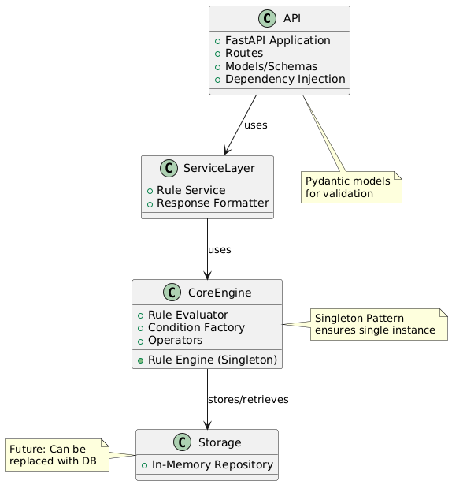
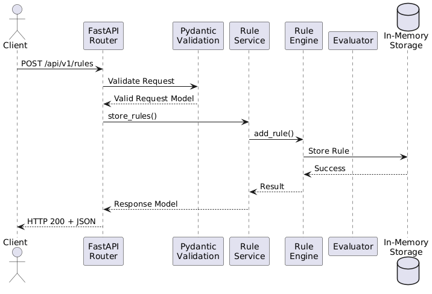
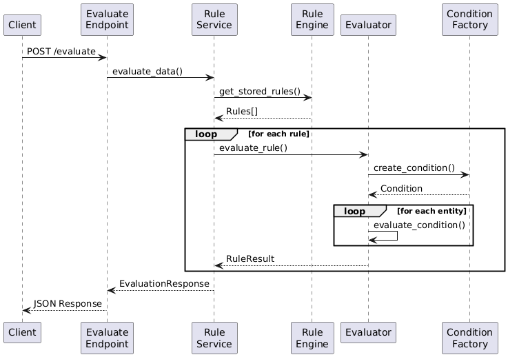
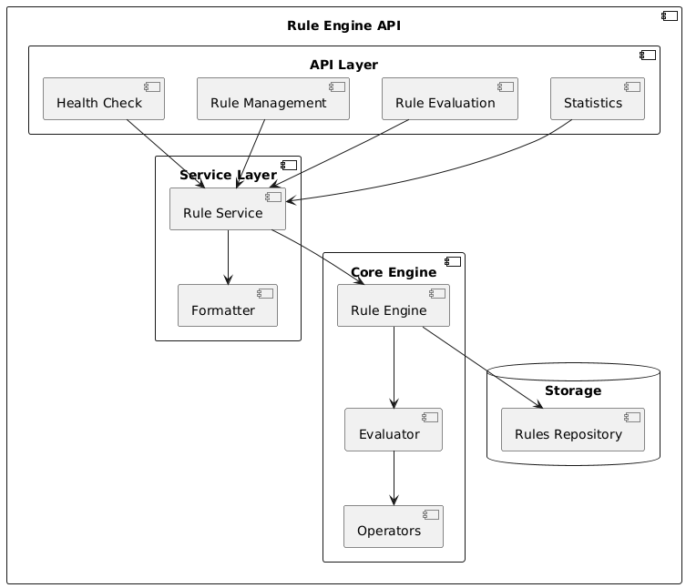
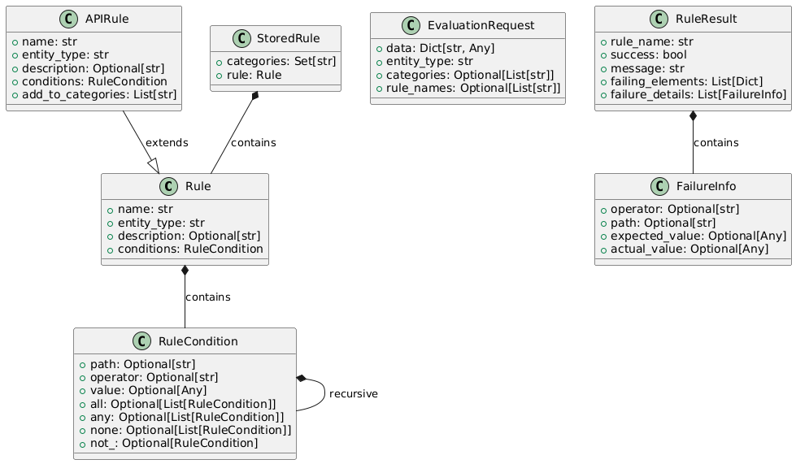
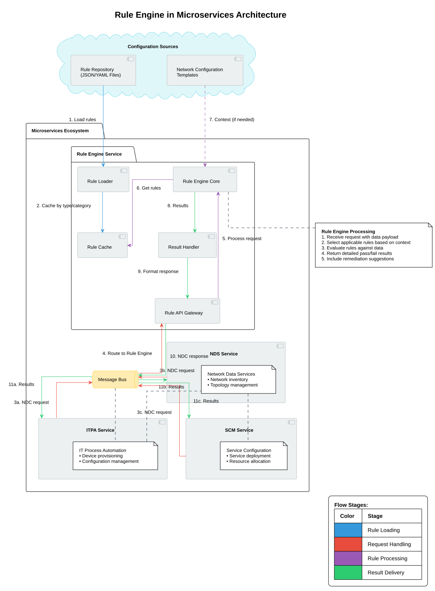

# Rule Engine NDC

A modular and flexible rule engine API for evaluating conditions against data, built with FastAPI and designed for microservices architecture.

## Table of Contents
- [Features](#features)
- [Architecture](#architecture)
- [Technology Stack](#technology-stack)
- [Installation](#installation)
- [API Documentation](#api-documentation)
- [Rule Engine Core](#rule-engine-core)
- [Testing](#testing)
- [Contributing](#contributing)

## Features

### Core Features
- RESTful API built with FastAPI framework
- Modular design with clear separation of concerns
- Support for complex nested conditions with logical operators (AND, OR, NOT, NONE)
- Various operators for comparing values (equality, inequality, numeric comparisons, regex, etc.)
- Rule categorization and management system
- Detailed evaluation results with failing elements and failure reasons
- JSON-based rule definitions for easy creation and sharing
- Singleton pattern for rule engine instance management
- Comprehensive logging with contextual information

### API Features
- Health check endpoint for service monitoring
- Rule validation before storage
- Bulk rule storage with overwrite capability
- Rule filtering by entity type and categories
- Dynamic category management (add/remove)
- Evaluation against stored rules or provided rules
- Detailed failure analysis and statistics

## Architecture

### High-Level Architecture



### API Request Flow



### Rule Evaluation Flow



### Component Diagram



### Class Diagram for Models



## Technology Stack

- **Framework**: FastAPI (Modern, fast web framework for building APIs)
- **Validation**: Pydantic v2 (Data validation using Python type annotations)
- **Testing**: Pytest with pytest-mock
- **HTTP Client**: TestClient from FastAPI for integration tests
- **Logging**: Custom logging with contextual parameters
- **Python**: 3.9+

## Installation

```bash
# Clone the repository
git clone git@github.com:EMOrg-Prd/NDCv4-rules-ms.git
cd NDCv4-rules-ms

# Create virtual environment
python -m venv venv

# Activate virtual environment
# On Windows:
venv\Scripts\activate
# On Unix or MacOS:
source venv/bin/activate

# Install dependencies
pip install -r requirements.txt

# Run the application
uvicorn main:app --reload --port 8080

# Or use the run script
python main.py
```

### Environment Configuration

Create a `.env` file in the root directory (optional):

```env
PROJECT_NAME="Rule Engine API"
PROJECT_DESCRIPTION="A flexible rule engine for evaluating conditions against data"
VERSION="1.0.0"
API_PREFIX="/api/v1"
PORT=8080
ENVIRONMENT="development"
ALLOWED_ORIGINS=["*"]
```

## API Documentation

### Base URL
```
http://localhost:8080/api/v1
```

### OpenAPI Documentation
- Swagger UI: `http://localhost:8080/docs`
- ReDoc: `http://localhost:8080/redoc`

### Endpoints

#### Health Check

```http
GET /api/v1/health
```

**Response:**
```json
{
  "status": "ok",
  "version": "1.0.0"
}
```

#### Rule Management

##### Validate Rule

```http
POST /api/v1/rules/validate
```

**Request Body:**
```json
{
  "name": "Device Compliance Rule",
  "entity_type": "device",
  "description": "Ensures devices meet compliance standards",
  "conditions": {
    "all": [
      {
        "path": "$.devices[*].vendor",
        "operator": "equal",
        "value": "Cisco Systems"
      }
    ]
  }
}
```

**Response:**
```json
{
  "valid": true,
  "errors": null
}
```

##### Store Rules

```http
POST /api/v1/rules
```

**Request Body:**
```json
{
  "rules": [
    {
      "name": "Management IP Required",
      "entity_type": "device",
      "description": "All devices must have a management IP",
      "conditions": {
        "path": "$.devices[*].mgmtIP",
        "operator": "exists",
        "value": true
      },
      "add_to_categories": ["compliance", "network"]
    }
  ]
}
```

**Response:**
```json
{
  "success": true,
  "message": "Successfully stored rules: 1 new, 0 updated",
  "stored_rules": 1
}
```

##### List Rules

```http
GET /api/v1/rules?entity_type=device&categories=compliance&categories=network
```

**Response:**
```json
{
  "rules": [
    {
      "rule_name": "Management IP Required",
      "entity_type": "device",
      "description": "All devices must have a management IP",
      "conditions": {
        "path": "$.devices[*].mgmtIP",
        "operator": "exists",
        "value": true
      },
      "categories_associated_with": ["compliance", "network"]
    }
  ]
}
```

##### Update Rule Categories

```http
POST /api/v1/rules/categories
```

**Request Body:**
```json
{
  "rule_name": "Management IP Required",
  "entity_type": "device",
  "categories": ["security", "audit"],
  "category_action": "add"
}
```

**Response:**
```json
{
  "success": true,
  "message": "Successfully added categories ['security', 'audit'] for device rule 'Management IP Required'"
}
```

#### Rule Evaluation

##### Evaluate with Stored Rules

```http
POST /api/v1/evaluate
```

**Request Body:**
```json
{
  "entity_type": "device",
  "categories": ["compliance"],
  "data": {
    "devices": [
      {
        "id": "device-001",
        "vendor": "Cisco Systems",
        "osVersion": "17.3.6",
        "mgmtIP": "192.168.1.1"
      }
    ]
  }
}
```

**Response:**
```json
{
  "entity_type": "device",
  "categories": ["compliance"],
  "rule_names": null,
  "total_rules": 1,
  "passed_rules": 1,
  "failed_rules": 0,
  "results": [
    {
      "rule_name": "Management IP Required",
      "success": true,
      "message": "All entities fulfill the rule",
      "failing_elements": [],
      "failure_details": []
    }
  ]
}
```

##### Evaluate with Provided Rules

```http
POST /api/v1/evaluate/with-rules
```

**Request Body:**
```json
{
  "entity_type": "device",
  "rules": [
    {
      "name": "Cisco Version Check",
      "entity_type": "device",
      "conditions": {
        "all": [
          {
            "path": "$.devices[*].vendor",
            "operator": "equal",
            "value": "Cisco Systems"
          },
          {
            "path": "$.devices[*].osVersion",
            "operator": "match",
            "value": "^17\\."
          }
        ]
      }
    }
  ],
  "data": {
    "devices": [
      {
        "id": "device-001",
        "vendor": "Cisco Systems",
        "osVersion": "16.9.5"
      }
    ]
  }
}
```

**Response:**
```json
{
  "entity_type": "device",
  "categories": null,
  "total_rules": 1,
  "passed_rules": 0,
  "failed_rules": 1,
  "results": [
    {
      "rule_name": "Cisco Version Check",
      "success": false,
      "message": "1 of 1 entities do not fulfill the rule",
      "failing_elements": [
        {
          "id": "device-001",
          "vendor": "Cisco Systems",
          "osVersion": "16.9.5"
        }
      ],
      "failure_details": [
        {
          "operator": "match",
          "path": "$.devices[*].osVersion",
          "expected_value": "^17\\.",
          "actual_value": "16.9.5"
        }
      ]
    }
  ]
}
```

#### Statistics and Analysis

##### Get Evaluation Statistics

```http
GET /api/v1/evaluate/stats
```

**Response:**
```json
{
  "total_rules": 15,
  "entity_types": 3,
  "supported_operators": [
    "equal", "not_equal", "greater_than", "less_than",
    "greater_than_equal", "less_than_equal", "exists",
    "not_empty", "match", "contains", "role_device"
  ],
  "max_rules_per_request": 100,
  "rule_stats_by_entity": {
    "device": {
      "total_rules": 8,
      "categories": {
        "compliance": 5,
        "security": 3
      }
    }
  }
}
```

##### Get Rule Failure Details

```http
GET /api/v1/evaluate/failure-details/Management%20IP%20Required?entity_type=device
```

**Response:**
```json
{
  "rule_name": "Management IP Required",
  "found": true,
  "entity_type": "device",
  "category": "compliance",
  "description": "All devices must have a management IP",
  "conditions_count": 1,
  "operators_used": ["exists"],
  "paths_used": ["$.devices[*].mgmtIP"],
  "structure": [
    {
      "type": "simple",
      "path": "$.devices[*].mgmtIP",
      "operator": "exists",
      "expected_value": true,
      "parent_path": ""
    }
  ],
  "rule_definition": {
    "name": "Management IP Required",
    "conditions": {
      "path": "$.devices[*].mgmtIP",
      "operator": "exists",
      "value": true
    }
  }
}
```

### API Models (Pydantic Schemas)

The API uses Pydantic for request/response validation. Key models include:

- **Rule**: Basic rule structure with name, entity_type, description, and conditions
- **APIRule**: Extended rule model with category management
- **RuleCondition**: Recursive model supporting simple and composite conditions
- **EvaluationRequest**: Request model for data evaluation
- **EvaluationResponse**: Detailed response with pass/fail results
- **RuleValidationResponse**: Validation results with specific errors
- **FailureDetail**: Detailed information about evaluation failures

## Rule Engine Core

### Supported Operators

| Operator | Description | Example |
|----------|-------------|---------|
| `equal` | Tests if values are equal | `{"operator": "equal", "value": "Cisco"}` |
| `not_equal` | Tests if values are not equal | `{"operator": "not_equal", "value": "down"}` |
| `greater_than` | Tests if value is greater than target | `{"operator": "greater_than", "value": 90}` |
| `less_than` | Tests if value is less than target | `{"operator": "less_than", "value": 10}` |
| `greater_than_equal` | Tests if value is greater than or equal | `{"operator": "greater_than_equal", "value": 100}` |
| `less_than_equal` | Tests if value is less than or equal | `{"operator": "less_than_equal", "value": 50}` |
| `exists` | Tests if a value exists (is not null) | `{"operator": "exists", "value": true}` |
| `not_empty` | Tests if a collection or string is not empty | `{"operator": "not_empty", "value": true}` |
| `match` | Tests if a string matches a regex pattern | `{"operator": "match", "value": "^[A-Z]{3}-\\d{4}$"}` |
| `contains` | Tests if a string/array contains a value | `{"operator": "contains", "value": "error"}` |
| `in_list` | Tests if a value exists in a list | `{"operator": "in_list", "value": ["HTTP", "HTTPS"]}` |
| `role_device` | Special operator for device role validation | `{"operator": "role_device", "value": "primary"}` |

### Complex Rule Example

```json
{
  "name": "Network Security Compliance",
  "entity_type": "device",
  "description": "Comprehensive network device security check",
  "conditions": {
    "all": [
      {
        "any": [
          {
            "all": [
              {
                "path": "$.devices[*].vendor",
                "operator": "equal",
                "value": "Cisco Systems"
              },
              {
                "path": "$.devices[*].osVersion",
                "operator": "match",
                "value": "^17\\.[3-9]\\."
              }
            ]
          },
          {
            "all": [
              {
                "path": "$.devices[*].vendor",
                "operator": "equal",
                "value": "Juniper"
              },
              {
                "path": "$.devices[*].securityLevel",
                "operator": "greater_than_equal",
                "value": 8
              }
            ]
          }
        ]
      },
      {
        "path": "$.devices[*].lastSecurityAudit",
        "operator": "exists",
        "value": true
      },
      {
        "none": [
          {
            "path": "$.devices[*].vulnerabilities",
            "operator": "contains",
            "value": "critical"
          },
          {
            "path": "$.devices[*].patchStatus",
            "operator": "equal",
            "value": "outdated"
          }
        ]
      }
    ]
  }
}
```


## Extending the Engine

### Adding New Operators

1. Add a new static method to the `Operator` class in `rule_engine/conditions/operators.py`
2. Register the operator in the `get_operator_function` method

### Adding New Condition Types

1. Create a new class that inherits from `Condition` in `rule_engine/conditions/base.py`
2. Implement the required methods: `evaluate`, `to_dict`, and `from_dict`
3. Register the condition type in the `ConditionFactory.create_condition` method

### Rule Engine Workflow


### Rule Engine in Microservices Architecture


## Testing

The project includes comprehensive test coverage using pytest:

### Test Categories

#### API Tests (`test_api_endpoints.py`)
- Endpoint functionality testing
- Request/response validation
- Error handling
- Rule overwrite functionality
- Category management

#### Service Tests (`test_rule_service.py`)
- Rule validation logic
- Storage operations
- Category add/remove operations
- Exception handling

#### Engine Tests
- **Simple Rules** (`test_simple_rules.py`): Basic operator testing
- **Complex Rules** (`test_complex_rules.py`): Nested logical operators
- **Nested Rules** (`test_nested_rules.py`): Deep nesting scenarios
- **Operators** (`test_operators.py`): Individual operator validation
- **Path Utils** (`test_path_utils.py`): JSONPath handling
- **Role Device** (`test_role_device_operator.py`): Special operator testing

### Running Tests

```bash
# Run all tests
pytest

# Run with coverage
pytest --cov=app --cov=rule_engine

# Run specific test file
pytest tests/test_api_endpoints.py

# Run with verbose output
pytest -v

# Run specific test
pytest tests/test_api_endpoints.py::test_validate_rule_endpoint
```

### Test Structure

```
tests/
├── integration/
│   └── test_api_endpoints.py
├── unit/
│   ├── test_rule_service.py
│   ├── test_response_formatter.py
│   └── test_rule_service_util.py
└── rule_engine/
    ├── test_simple_rules.py
    ├── test_complex_rules.py
    ├── test_nested_rules.py
    ├── test_operators.py
    ├── test_path_utils.py
    └── test_role_device_operator.py
```

## Performance Considerations

- **Singleton Pattern**: Rule Engine uses singleton pattern to maintain a single instance
- **In-Memory Storage**: Current implementation stores rules in memory (suitable for moderate rule sets)
- **Lazy Evaluation**: Conditions are evaluated lazily, stopping at first failure in AND operations
- **Path Caching**: Consider implementing path result caching for repeated evaluations

## Future Enhancements

1. **Persistence Layer**: Add database support for rule storage
2. **Rule Versioning**: Track rule changes over time
3. **Async Evaluation**: Support for asynchronous rule evaluation
4. **Rule Templates**: Pre-defined rule templates for common scenarios
5. **Performance Metrics**: Add detailed performance tracking
6. **WebSocket Support**: Real-time rule evaluation updates
7. **Rule Import/Export**: Support for various formats (YAML, XML)
8. **Authentication**: Add API authentication and authorization

## Contributing

For Contributions please add the story: example: story/7424522-add-new-operator by AT

### Development Guidelines

1. Follow PEP 8 style guide
2. Add type hints to all functions
3. Write comprehensive tests for new features
4. Update API documentation
5. Use meaningful commit messages
6. Create feature branches from main

### Code Structure

```
NDCv4-rules-ms/
├── app/
│   ├── api/
│   │   ├── models/         # Pydantic models
│   │   └── routes/         # FastAPI routes
│   ├── core/              # Core configuration
│   ├── services/          # Business logic
│   ├── helpers/           # Utility functions
│   └── utilities/         # Logging and helpers
├── rule_engine/
│   ├── conditions/        # Condition implementations
│   ├── core/             # Core engine logic
│   └── utils/            # Engine utilities
├── tests/                # Test files
├── main.py              # Application entry point
└── requirements.txt     # Dependencies
```